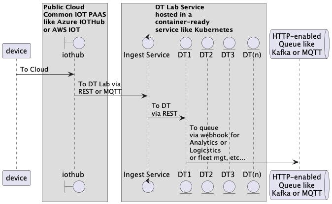

Digital Twin Laboratory
============

***a digital twin runtime framework***

-------

DT Lab is an actor-oriented distributed computing framework that can be programmed
to host clusters of DTs (Digital Twins).

Typical applications are IOT, AR, Logistics, general purpose streaming analytics -
any problem that requires near-realtime continuous calculation of actionable
states at scale.

The DT Lab implementation values actor programming, asynchronous messaging, and
persistence via event sourcing.

## What is a DT?

Digital twins are software analogs for devices, processes, or collections of digital
twins.  The term "digital twin" is used to distinguish the DT from other software modeling
with an emphasis on individually programmable software objects, each of whose state is
recalculated continuously as observations arrive in a low latency unbounded stream from the DT's counterpart.

Examples of observations and events monitored by a DTs are:

  * Machine DTs might monitor a machine's engine temperature
  * Supply chain replenishment DTs monitor retail sales transaction completions
  * Trading bot DTs might want to know about the new availability of funds from a bank account wire transfer
  * Energy Efficiency DTs monitor doors that stay open too long
  * A truck fleet DT might adjust truck assignments if observes vehicle mileage readings and it anticipates future mileage-based maintenance window overlaps - it can schedule long haul vs short haul assignments to stagger the out-of-service maintenance windows across the fleet
  * Security DTs fire alerts if motion detectors are triggered
  * A hemisphere evacuation alerting DT might monitor an approaching asteroid's current speed

In DT Lab, Each DT:

  * computes its own state
  * receives continuous input from counterparts
  * is independently addressable - ask any DT about its state any time

## DT Lab Quick Start

TODO TODO TODO

## DT Lab Usage

TODO TODO TODO

## DT Lab Architecture

Introduction and Goals
-------

The DT Lab framework enables a user to instantiate a system of digital twins
in the public cloud or on-prem cluster of computers.

The project goal is that a useful system can be instantiated from configured
Dt Lab components with complete security and integration features.  It is
also the goal of DT LAB to support configuration entirely in a declarative
style deployment-time configuration via REST-like API - no dropping down into
first class programming languages required to host useful DTs.

Constraints
-------

* MIT/BSD/Apache2 licensed dependencies (100% Open Source)
* No reliance on VM abstractions (100% containerized)
* Can run on a system-on-a-board (1g RPi)
* Completely programmable via API (no config files)

Context and Scope
-------

The DT Lab system is operated as a utility and service.

In its initial releases, DT Lab can support DTs for sources that emit telemetry
in JSON format.  Other data formats will be added as they are requested.

External automation can interact with the DTs via the DT Lab HTTP API.
A normal use case would be for an external system to register a webhook with
a DT Lab cluster and listen for assessments calculated by the DTs as their
state advances.

DT Lab may be operated by an organization for its own purposes or by a
service provider for its customers - perhaps as a SAAS.

If operated as a SAAS, the operator would need to provide a front-end to
its customers that supported multi-tenancy.  No changes to the
DT Lab code base would be required to support multi-tenancy but the API calls
to operate the system on behalf of the SAAS users should be sharded across
clusters with tenant ID enforced in the sharding.

Solution Strategy
-------

The system is developed with modern cloud infrastructure-as-code tools and
practices in mind.  A new deployment should be able to be instantiated via
CI/CD pipelines in the cloud or via an IOT solution push of firmware/appware
to a a smart edge device with no manual intervention.  Input and output should
be in standard marshaling syntaxes (JSON, etc...) for off-the-shelf integration
with other systems.

Building Block View
-------

Runtime View
-------

Deployment View
-------

Technical infrastructure with environments, computers, processors, topologies. Mapping of (software) building blocks to infrastructure elements.

Cross Cutting Concepts
-------

Overall, principal regulations and solution approaches relevant in multiple parts (→ cross-cutting) of the system. Concepts are often related to multiple building blocks. Include different topics like domain models, architecture patterns and -styles, rules for using specific technology and implementation rules.

Architectural Decisions
-------

Important, expensive, critical, large scale or risky architecture decisions including rationales.

Quality Requirements
-------

Quality requirements as scenarios, with quality tree to provide high-level overview. The most important quality goals should have been described in section 1.2. (quality goals).

Risks
-------

***NO ONE IS USING THIS SOFTWARE FOR REAL WORK TO OUR KNOWLEDGE***

## Project Status

DT Lab is currently a single-contributor project by [Ed Sweeney](https://github.com/navicore) 
and licensed with [the MIT Open Source license](https://github.com/DTLaboratory/dtlab-scala-alligator/blob/master/LICENSE).

Pull requests, feedback, and collaboration welcome.

We believe the features and component responsibility divisions in DT Lab are
worth studying, implementing, and refining in other languages and platforms - we
intend to create Python, Rust, and Erlang/Elixir implementations, time permitting.

### Links

1. [Github](https://github.com/DtLaboratory) - all the code is Open Source
1. CICD is managed by Github [Actions](https://github.com/features/actions)
1. Code quality is monitored by [Codacy](https://app.codacy.com/organizations/gh/DtLaboratory/repositories)
1. SBT dependency updates are managed by the [Scala Steward](https://github.com/scala-steward-org/scala-steward) bot PRs
1. Docker images are at [Dockerhub](https://hub.docker.com/orgs/dtlaboratory/repositories) (for now)
1. [UI](https://sandbox.dtlaboratory.com) - will host a react.js UI for talking to DTs - currently only demo for Auth0 SSO
1. [Notebooks (Jupyterhub)](https://notebook.somind.tech) - contact Navicore to get your github ID whitelisted
1. DtLab API [Docs](https://somind.tech/dtlab-alligator/doc/dtlab/) - OpenAPI 3.0
1. DtLab API sandbox endpoint - https://sandbox.somind.tech/dtlab-alligator/(type/actor)
1. DtLab Ingest API [Docs](https://somind.tech/dtlab-alligator/doc/dtlab-ingest/) - OpenAPI 3.0
1. DtLab Ingest API sandbox endpoint - https://sandbox.somind.tech/dtlab-alligator/extractor/(specId)
1. Security is Implemented by [Auth0](https://manage.auth0.com/dashboard/us/navicore/) - contact Navicore for access
1. Project Kanban with backlog and help wanted tags is [here](https://github.com/orgs/DtLaboratory/projects/1)
1. This page is generated from the `gh-pages` branch of the [DtLaboratory.github.io](https://github.com/DtLaboratory/DtLaboratory.github.io/blob/gh-pages/index.md)

### Hosting

1. The system is currently run on Digital Ocean managed Kubernetes.
1. TLS is implemented with Lets Encrypt.
1. DT event sourcing is persisted to Digital Ocean managed Postgres.
1. IOT Device Management and Connectivity via Cloud PAAS
    * AWS IOT Core is deployed with webhook forwarding to the DtLab sandbox Ingest Service (contact Navicore for access)
    * MQTT (TBD)
    * Azure IotHub (TBD)

### Support or Contact

Want more information or to get involved?  Open an issue [here](https://github.com/DtLaboratory/DtLaboratory.github.io/issues) and say hello or DM @navicore on Twitter.
