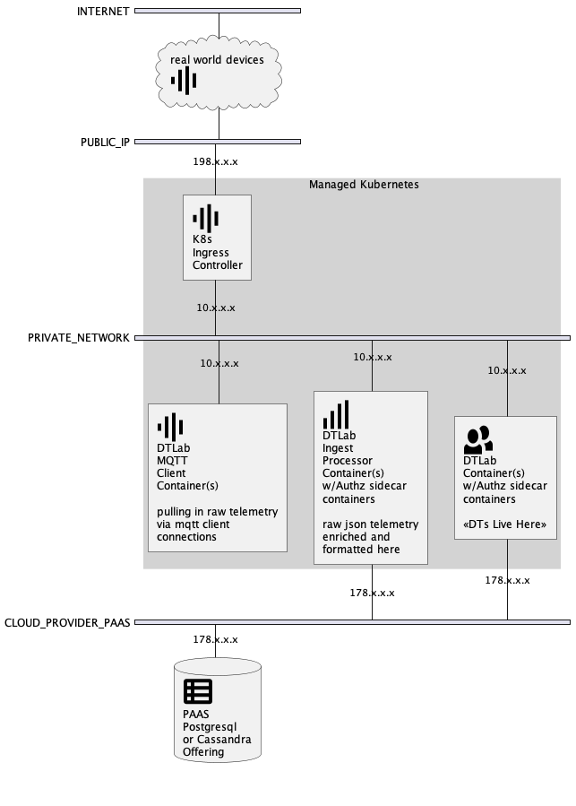

Digital Twin Laboratory
============

***a digital twin runtime framework***

-------

DT Lab is an actor-oriented distributed computing framework that can be programmed
to host clusters of DTs (Digital Twins).

Typical applications are IOT, AR, Logistics, general purpose streaming analytics -
any problem that requires near-realtime continuous calculation of actionable
states at scale.

The DT Lab implementation values actor programming, asynchronous messaging, and
persistence via event sourcing.

## What is a DT?

Digital twins are software analogs for devices, processes, or collections of digital
twins.  The term "digital twin" is used to distinguish the DT from other software modeling
with an emphasis on individually programmable software objects, each of whose state is
recalculated continuously as observations arrive in a low latency unbounded stream from the DT's counterpart.

Examples of observations and events monitored by a DTs are:

  * Machine DTs might monitor a machine's engine temperature
  * Supply chain replenishment DTs monitor retail sales transaction completions
  * Trading bots might monitor a bank account DT to act on the new availability of funds
  * Energy Efficiency DTs monitor doors that stay open too long
  * A truck fleet DT monitoring truck odometer readings might adjust truck assignments if it anticipates future mileage-based maintenance window overlaps - it can schedule long haul vs short haul assignments to stagger the out-of-service maintenance windows across the fleet
  * Security DTs fire alerts if motion detectors are triggered
  * A hemisphere evacuation alerting system might act on an approaching asteroid's DT's current speed and distance values

In DT Lab, Each DT:

  * computes its own state
  * receives continuous input from counterparts
  * is independently addressable - ask any DT about its state any time

## DT Lab Quick Start

TODO TODO TODO

## DT Lab Usage

TODO TODO TODO

## DT Lab Architecture

Introduction and Goals
-------

The DT Lab framework enables a user to instantiate a system of digital twins
in the public cloud or on-prem cluster of computers.

The project goal is that a useful system can be instantiated from configured
DT Lab components with complete security and integration features.  It is
also the goal of DT Lab to support configuration entirely in a declarative
deployment-time style via REST-like API - no first class programming language
coding should be required to program useful DTs.

Constraints
-------

* MIT/BSD/Apache2 licensed dependencies (100% Open Source)
* No reliance on VM abstractions (100% containerized)
* Can run on a system-on-a-board (1g RPi)
* Completely programmable via API (no config files)

Context and Scope
-------

The DT Lab system is operated as a utility and service.

In its initial releases, DT Lab can support DTs for sources that emit telemetry
in JSON format.  Other data formats will be added as they are requested.

External automation can interact with the DTs via the DT Lab HTTP API.
A normal use case would be for an external system to register a webhook with
a DT Lab cluster and listen for assessments calculated by the DTs as their
state advances.

DT Lab may be operated by an organization for its own purposes or by a
service provider for its customers - perhaps as a SAAS.

If operated as a SAAS, the operator would need to provide a front-end to
its customers that supported multi-tenancy.  No changes to the
DT Lab base code would be required to support multi-tenancy but the API calls
to operate the system on behalf of the SAAS users should be sharded across
clusters with tenant ID enforced in the sharding.

Solution Strategy
-------

The system is developed with modern cloud infrastructure-as-code tools and
practices in mind.  A new deployment can be instantiated via CI/CD pipelines
in the cloud or via an IOT solution push of firmware/appware to a a smart
edge device with no manual intervention.  Input from the DT's analogs must
arrive in standard marshaling syntaxes (JSON, etc...) for out-of-the-box
integration.  Output is marshaled in JSON and is available as an unbounded
stream so that it can be processed by modern analytics tools like Apache Spark,
Grafana, Elastic Search, or accumulated in cloud Blob services like Azure
Storage or AWS S3, etc...

Building Block View
-------

The primary building blocks are the digital twin and an incoming unbounded
stream of observations. The state of the digital twins can be processed by
traditional off-the-shelf data analytics tools.

Runtime View
-------

The system tends to flow from left to right with observations starting at the
left and DT state shared to standard tools at the right.

Deployment View
-------

A normal deployment would be managed Kubernetes from a cloud provider paired
with a managed database.  However, all the DTLab Docker images make no
Kubernetes or PAAS-database assumption and the system can be run in any
Docker-enabled environment.

Cross Cutting Concepts
-------

Actor programming, event sourcing, and 100% API config are the main cross
cutting implementation concepts used in individual components.

Architectural Decisions
-------

Important, expensive, critical, large scale or risky architecture decisions including rationales.

1. Scala and Akka
  * The first implementation is written in Scala.
  * Actor programming and pattern matching are leveraged throughout the code - these two features are harder to use in other languages.  The choices were between Scala and Erlang/Elixir to get these features and Erlang/Elixir has not been made container-friendly yet.  Scala is a bit more accessible than Erlang/Elixir because of the popularity of the JVM it runs on on integration with Java.
  * Risk is the Scala community - ugh.
2. Webhooks
  * Pushing queue processing to the outer edges of the system and using webhooks and HTTP as the main composability approach.  Composing with webhooks can be optimized via sidecar containers.
  * A risk is HTTP overhead - future implementations will probably want gRPC or similar intra-system binary APIs.
3. Event Sourcing
  * Auditable
  * No complex database models improperly designed - fewer scaling problems due to poor partitioning and clustering.
  * Rewind and recalculation (back-testing) features are enabled with event sourcing.
  * Prototype-based programming of DTs is enabled via event sourcing.
4. Fault-tolerance via containerization, sharding / partitioning - the deployment must still work with n-1 containers.

Quality Requirements
-------

* Process back-testing of 10 million devices 24X faster than the live system collects the data.
* Survive chaos agent testing.
* Actor state query API must remain responsive under all ingest loads.

Risks
-------

***NO ONE IS USING THIS SOFTWARE FOR REAL WORK TO OUR KNOWLEDGE***

## Project Status

DT Lab is currently a single-contributor project by [Ed Sweeney](https://github.com/navicore) 
and licensed with [the MIT Open Source license](https://github.com/dtlaboratory/dtlab-scala-alligator/blob/master/LICENSE).

Pull requests, feedback, and collaboration welcome.

We believe the features and component responsibility divisions in DT Lab are
worth studying, implementing, and refining in other languages and platforms - we
intend to create Python, Rust, and Erlang/Elixir implementations, time permitting.

### Links

1. [Github](https://github.com/dtlaboratory) - all the code is Open Source
1. CICD is managed by Github [Actions](https://github.com/features/actions)
1. Code quality is monitored by [Codacy](https://app.codacy.com/organizations/gh/dtlaboratory/repositories)
1. SBT dependency updates are managed by the [Scala Steward](https://github.com/scala-steward-org/scala-steward) bot PRs
1. Docker images are at [Dockerhub](https://hub.docker.com/orgs/dtlaboratory/repositories) (for now)
1. [UI](https://sandbox.dtlaboratory.com) - will host a react.js UI for talking to DTs - currently only demo for Auth0 SSO
1. [Notebooks (Jupyterhub)](https://notebook.somind.tech) - contact Navicore to get your github ID whitelisted
1. DTLab API [Docs](https://somind.tech/dtlab-alligator/doc/dtlab/) - OpenAPI 3.0
1. DTLab API sandbox endpoint - https://sandbox.somind.tech/dtlab-alligator/(type/actor)
1. DTLab Ingest API [Docs](https://somind.tech/dtlab-alligator/doc/dtlab-ingest/) - OpenAPI 3.0
1. DTLab Ingest API sandbox endpoint - https://sandbox.somind.tech/dtlab-alligator/extractor/(specId)
1. Security is Implemented by [Auth0](https://manage.auth0.com/dashboard/us/navicore/) - contact Navicore for access
1. Project Kanban with backlog and help wanted tags is [here](https://github.com/orgs/dtlaboratory/projects/1)
1. This page is generated from the `gh-pages` branch of the [DTLaboratory.github.io](https://github.com/dtlaboratory/dtlaboratory.github.io/blob/gh-pages/index.md)

### Hosting

1. The system is currently run on Digital Ocean managed Kubernetes.
1. TLS is implemented with Lets Encrypt.
1. DT event sourcing is persisted to Digital Ocean managed Postgres.
1. IOT Device Management and Connectivity via Cloud PAAS
    * AWS IOT Core is deployed with webhook forwarding to the DTLab sandbox Ingest Service (contact Navicore for access)
    * MQTT (TBD)
    * Azure IotHub (TBD)

### Support or Contact

Want more information or to get involved?  Open an issue [here](https://github.com/dtlaboratory/dtlaboratory.github.io/issues) and say hello or DM @navicore on Twitter.
